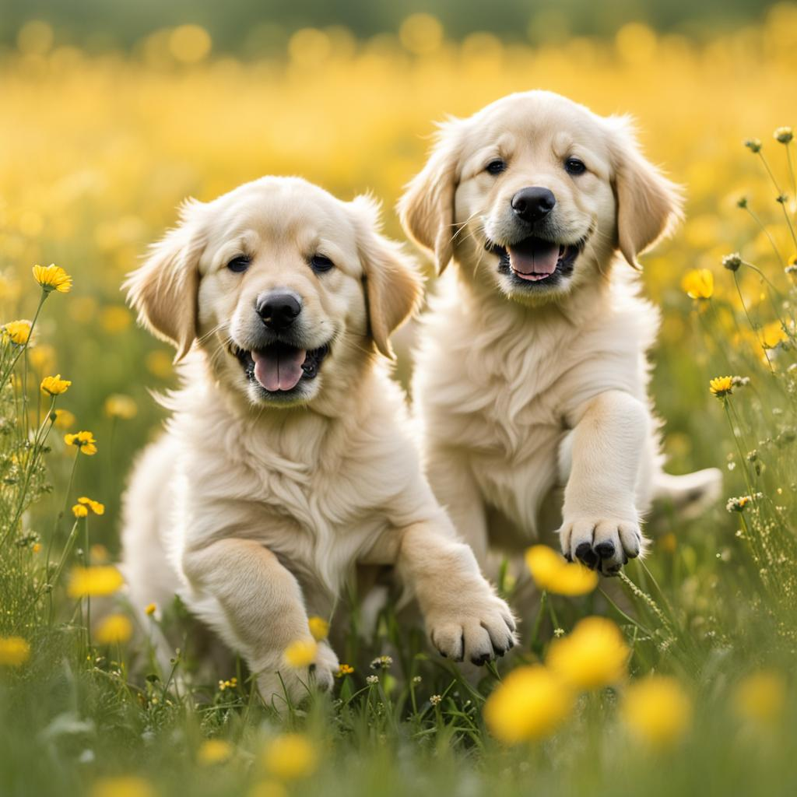

# gen-ai-detection

## Overview
This is GenAI Image Classification project built with Kedro library.

We are trying to discriminate between images that are taken in the real world or created by hand and images generated using generative models like DALLE, Midjourney, or Stable Diffusion.

From our world:


AI generated:


## Docker Image and dependencies

The project is meant to be run in a Docker container based on the supplied Dockerfile. Dependecies are manged by poetry and are installed during the Docker image build process. For testing run the following command:

```
poetry install --with test
```

## Kedro 

You can run Kedro project with:

```
kedro run
```

To visualize project run: 

```
kedro viz run
```

## Local deployment

To run everything locally, use Visual Studio Code devcontainer defined in `.devcontainer`. Create an empty file: `.devcontainer/devcontainer.env`.

## Weight and Biases
Add your Weight and Biases API key environment variable directly or in the `.devcontainer/devcontainer.env` file.
