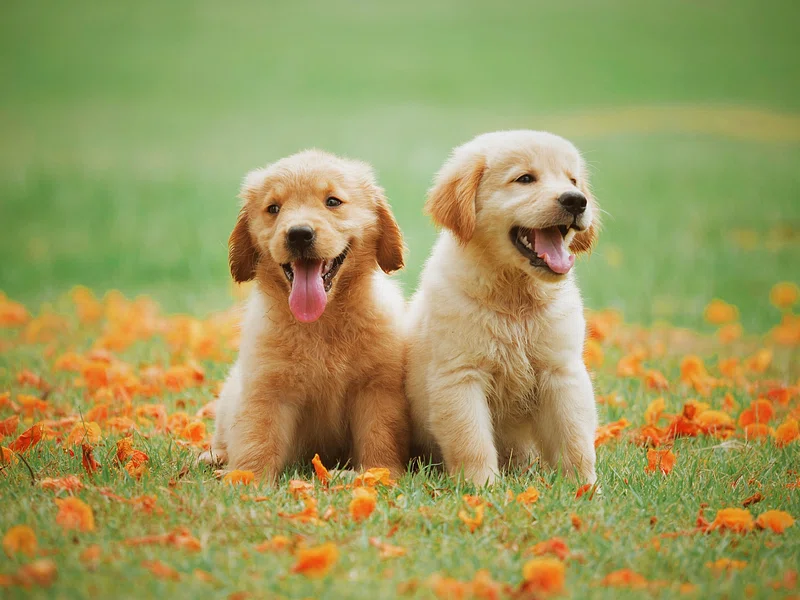

# gen-ai-detection

## Overview
This is GenAI Image Classification project built with Kedro library.

We are trying to discriminate between images that are taken in the real world or created by hand and images generated using generative models like DALLE, Midjourney, or Stable Diffusion.

From our world:


AI generated:


## How to install dependencies

To install them, run:

```
pip install -r requirements.txt
```

## How to run your Kedro pipeline

You can run Kedro project with:

```
kedro run
```

## Local deployment

To run everything locally, use Visual Studio Code devcontainer defined in `.devcontainer`.
